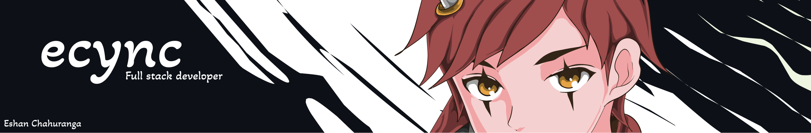

  

  &nbsp;&nbsp;&nbsp;
  &nbsp;&nbsp;&nbsp;
  &nbsp;&nbsp;&nbsp;
  &nbsp;&nbsp;&nbsp;

# **Hi there, I'm Eshan Chahuranga** :wave:

I transform ideas into high-performance web applications that are scalable by offering full-stack freelance services. Having competence in both front and back development, I code clean and maintainable code, create user-friendly interfaces, and develop stable systems that are fast and secure. I love working on technical and creative problems that require both precision in technical work and creativity in problem solving. It could be the development of custom APIs, the implementation of real-time capabilities, or the implementation of cloud-native apps. I am never shy to work as a team and always excited to transform complicated ideas into effective digital solutions.

 

# :sparkles: **About Me**
  

:computer: I am currently working on and developing my programming skills.

:rocket: I am capable of developing custom APIs, real-time applications, and cloud-native applications.

:bulb: Ask about technical and creative issues, creating successful digital solutions, and transforming complicated concepts into working applications.

:brain: I am interest in solving problems that require both precision in technical work and creativity in problem-solving.

:zap: I only like perfection.

 

<!-- Tech & Tools -->
# 🛠 **Tech & Tools**

## **Languages**

### **Frameworks & Libraries**

### **Tools & Platforms**

<!-- End Tech & Tools -->

<!-- GitHub Insights -->
# :bar_chart: **GitHub Insights**

<!-- End GitHub Insights -->

<!-- Featured Projects -->
# :star2: **Projects**

  
  

  

 

<!-- End Featured Projects -->

<!-- Connect Section -->

  # :handshake: **Let's Connect & Collaborate**

  I'm always open to discussing new opportunities, innovative projects, and meaningful collaborations.
   
  

    
    &nbsp;&nbsp;&nbsp;
    &nbsp;&nbsp;&nbsp;
    
    &nbsp;&nbsp;&nbsp;
    &nbsp;&nbsp;&nbsp;
    
  

  

      &nbsp;&nbsp;&nbsp;
      &nbsp;&nbsp;&nbsp;
      
    

<!-- End Connect Section -->

  

